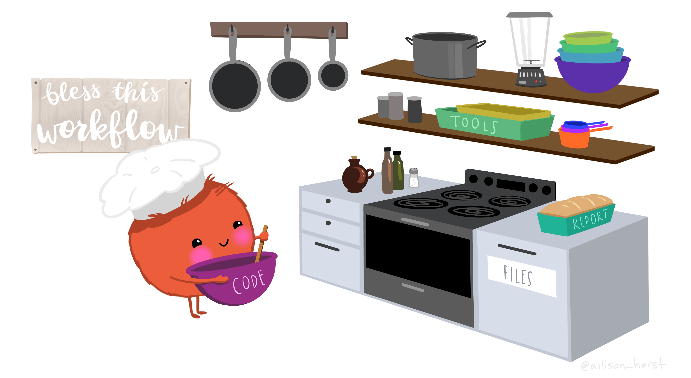
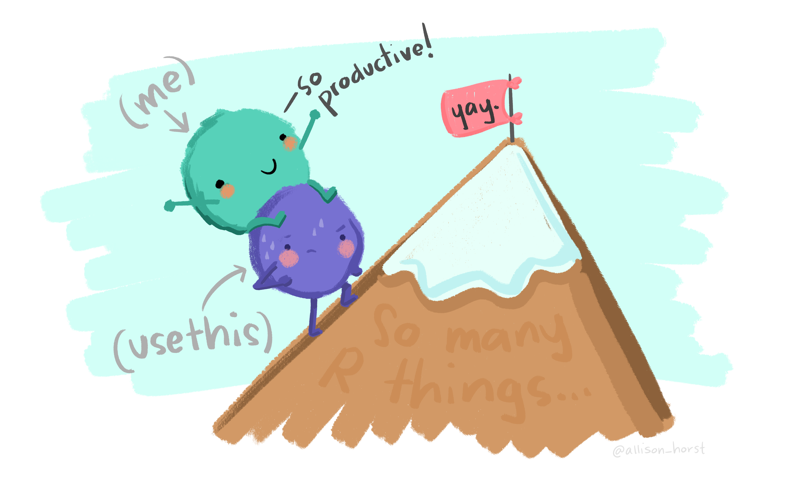

```{r setup, include=FALSE}
options(htmltools.dir.version = FALSE)
knitr::opts_chunk$set(comment = "#>", fig.align = "center")
options(dplyr.print_min = 5, dplyr.print_max = 5, dplyr.width = 70)
```

class: middle, center
# Iniciar gravação!

---
class: middle, center, inverse
# Ambiente

---
# Motivação

No _R para Ciência de Dados III_, vamos aprender tudo que falta sobre ciência de
dados no R. Falaremos sobre projetos, faxina de dados avançada, conexão com
bancos de dados, controle de versão, pacotes e integração.

Mas, antes de fazermos qualquer outra coisa, precisamos preparar nosso ambiente
de trabalho. Esse é um passo pouco abordado em outros cursos e livros, apesar de
ser muito importante na nossa opinião.

Garantir que o nosso ambiente de trabalho (virtual) está configurado
corretamente pode ser a diferença entre uma experiência de programação tranquila
e um verdadeiro pesadelo de reprodutibilidade. O grande problema é que,
inicialmente, vai parecer que estamos dificultando nossas vidas de propósito!

E isso é verdade até certo ponto. Vamos trocar um pouco de conforto por
garantias robustas e resilientes. A sensação é a mesma de tirar as rodinhas de
uma bicicleta: no início pedalar fica mais difícil, mas depois percebemos que
conseguimos ir muito mais longe em muito menos tempo.

---
# Checklist

- [R e RStudio](https://livro.curso-r.com/1-1-instalacao-do-r.html) instalados

- Pacotes instalados: devtools, usethis, pkgdown, testthat, roxygen2 e knitr

- [Ferramentas de desenvolvimento](https://r-pkgs.org/setup.html#setup-tools):

  - Windows: [RTools instalado](https://livro.curso-r.com/1-3-instalacao-adicionais.html#rtools)

  - Linux: [r-base-dev](https://livro.curso-r.com/1-3-instalacao-adicionais.html#rtools)

  - MacOS: [Xcode command line tools](https://docs.brew.sh/Installation#macos-requirements)

No final queremos que a `has_devel()` retorne a mensagem abaixo:

```{r}
devtools::has_devel()
```

---
# Fonte da verdade

É super comum precisar fechar o R e depois voltar para uma análise depois.
Também não é raro trabalhar em mais de uma análise simultaneamente e querer
deixá-las separadas.

Quando estamos aprendendo R, não tem problema assumir que o RStudio vai guardar
todos os objetos que você criar durante a sua análise. Entretanto, para que seja
mais fácil trabalhar em projetos grandes ou colaborar com outras pessoas, a
nossa **fonte da verdade** devem ser os scripts R.

Usando apenas seus scripts e seus dados, você deveria ser capaz de reproduzir
toda a sua análise. Se você depender apenas da informação salva na memória do
RStudio, é muito mais difícil recriar seus scripts: ou você vai ter que
reescrever um monte de código ou você vai ter que ler todo o seu histórico de
comandos.

Para que os scripts R sejam a fonte de verdade da sua análise, é recomendado
desabilitar algumas opções que o RStudio tem habilitadas por padrão...

---
# .RData e .Rhistory

Em sua configuração padrão, o RStudio vai manter na memória todos os últimos
comandos executados, todos os dados utilizados e todos os objetos criados.

Ao fechar e abrir o RStudio, essas informações serão recarregadas na memória
como se o usuário nunca tivesse saído do programa. Esse recurso é tornado
possível pela criação de dois arquivos ocultos chamados `.RData` e `.Rhistory`.

O primeiro abriga absolutamente todos os objetos criados por uma sessão R,
enquanto o segundo contém uma lista com os últimos comandos executados. Ao
reabrir o RStudio, o conteúdo armazenados nestes arquivos será carregado no
ambiente de trabalho atual como se nada tivesse acontecido.

É fácil imaginar como isso facilita muito a vida: depois de ler uma base com o
R, nunca mais precisamos nos preocupar em lê-la de novo; depois de rodar um
modelo complicado, nunca mais precisamos nos preocupar em rodá-lo de novo;
depois de tratar uma tabela muito grande, nunca mais precisamos nos preocupar em
tratá-la de novo.

---
# .RData e .Rhistory: desvantagens

Como falamos antes, os luxos do `.RData` e do `.Rhistory` vêm com desvantagens.
A maior parte delas diz respeito ao incentivo à reprodutibilidade:

- Se todos os resultados de uma análise estiverem sempre disponíveis, podemos
nos iludir e achar que nunca mais vamos precisar do código que gera esses
resultados. Isso diminui o incentivo à escrita de código legível.

- Quando dependemos da memória do RStudio, corremos o risco de sobrescrever sem
querer um objeto relevante e não sabermos mais recriar sua versão original.

- Não existe um jeito razoável de compartilhar a memória do nosso RStudio,
então, se estivermos trabalhando com outras pessoas, a única coisa
compartilhável que temos são os scripts.

- O RStudio trata todos os objetos guardados na memória igualmente, então o
`.RData` pode chegar a múltiplos gigabytes. Isso pode fazer com que o RStudio
fique perigosamente lento!

---
# .RData e .Rhistory: como desabilitar

O jeito mais simples de desabilitar o `.RData` e o `.Rhistory` é executando o
comando abaixo. Depois de rodá-lo uma vez, o RStudio já atualiza as suas
preferências.

```{r, eval = FALSE}
usethis::use_blank_slate()
```

A partir deste momento, quando você reiniciar o RStudio, ele não vai mais
lembrar do código que você executou na última sessão nem dos objetos ou tabelas
que você tinha criado. A curto prazo isso pode parecer uma chatice, mas no longo
prazo isso vai evitar muitos problemas.

Para garantir que você está escrevendo as coisas certas no seu script, use os
atalhos a seguir no RStudio (várias vezes por dia):

- `Cmd/Ctrl + Shift + 0/F10` para reiniciar o R.

- `Cmd/Ctrl + Shift + S` para re-rodar o script atual.

---
class: middle, center, inverse
# Fluxo de trabalho

---
# Motivação

Agora que nosso ambiente está configurado, podemos começar a falar sobre nosso
fluxo de trabalho. Esse termo é um pouco obscuro e engloba vários aspectos, mas
no geral ele se refere a todos os princípios que guiam o ato de programar.

Por exemplo, vamos falar sobre organização de arquivos e quais são as melhores
maneiras de nomeá-los. Também vamos falar sobre projetos, uma maneira eficiente
e inteligente de agrupar vários recursos relacionados. Por fim vamos discutir
estilística, ou seja, dicas que podem tornar os nossos programas mais legíveis
para nós mesmos e para qualquer outra pessoa com quem estivermos trabalhando.

Pode parecer que este módulo não é tão importante assim ou que o conteúdo é
meramente um compilado de sugestões, mas a realidade está longe disso. Quando
estivermos falando de pacotes (a melhor forma que temos de compartilhar código),
grande parte dos ensinamentos desta aula serão retomados como requisitos
_obrigatórios_ da sua programação.

Vamos começar pensando sobre o básico: scripts.

---
class: center

```{r, echo = FALSE}

```

[Ilustração por @allison_horst](https://twitter.com/allison_horst)

---
# Scripts

Scripts são a unidade fundamental de organização de código e, apesar de não
passarem de arquivos texto, scripts podem ser organizados de inúmeras formas.

Muita gente gosta de fazer um único script por projeto, enquanto outras dividem
cada tarefa em seu próprio arquivo. O ideal é não pecar nem pelo excesso e nem
pela falta: acumular muita coisa em um script só significa que vários códigos
serão executados desnecessariamente toda vez que reiniciarmos o RStudio, mas
também não queremos executar diversos arquivos para reproduzir uma análise
simples.

Uma ferramenta útil para nos ajudar é a função `source()`, que recebe o caminho
para um script e o executa como se estivéssemos usando `Cmd/Ctrl + Shift + S`.
Isso permite que declaremos no início de cada arquivo todas as suas dependências
em relação a outros arquivos, assim não precisamos lembrar disso separadamente.

O problema é que agora precisamos lidar com caminhos do computador, o que não é
uma tarefa tão fácil quanto parece. Vamos entender melhor como caminhos
funcionam e como eles se relacionam com projetos em R.

---
# Caminhos

Uma parte importante dos fluxos de trabalho está relacionada aos caminhos dos
arquivos. Temos 3 regras para como nomear arquivos e pastas: facilite para as
máquinas, facilite para os humanos e facilite a ordenação.

1. Seja consistente com maiúsculas/minúsculas, escolha um separador (`_` ou `-`)
e nunca use espaços, caracteres especiais (como `^.*?+|$"`) ou acentos.

2. Seja claro quanto à função e contexto dos arquivos, evitando nomes vagos e
curtos demais. Essa regra tem exceções que discutiremos mais a frente.

3. Quando usar datas, sempre prefira o formato `AAAA-MM-DD`. Quando usar
números, garanta que todos têm o mesmo comprimento adicionando `0` no começo dos
número mais curtos.

Seguindo essas regras, é difícil que tenhamos problemas com leitura ou
localização de arquivos ou pastas. O objetivo é criar um sistema consistente e
eficiente para facilitar a nossa vida o máximo possível.

---
# Caminhos: exemplos

.pull-left[

Recomendado:

```{sh, eval = FALSE}
rascunho01_redacao.docx

analise_descritiva_mtcars.R
anotacoes_aula02_r.docx

analise_2012-01-01.R
analise_2012-01-02.R
analise_2012-04-01.R

aula09_curso_diurno.docx
aula10_curso_diurno.docx
```

]

.pull-right[

**Não** recomendado:

```{sh, eval = FALSE}
Rascunho Redação(1).docx

analise.R
aula2.docx

analise_1-Janeiro-2012.R
analise_2-Janeiro-2012.R
analise_1-Abril-2012.R

aula9_curso_diurno.docx
aula10_curso_diurno.docx
```

]

Preste atenção especial à **ordenação** dos arquivos que têm datas ou números!

---
# Caminhos: dois tipos

Além de dar bons nomes para os arquivos, precisamos aprender a descrever suas
localizações de forma correta. Já falamos sobre isso no _R para Ciência de dados
I_, então vamos direto para uma metáfora: como eu poderia pedir para você achar
um documento na minha mesa do escritório?

.pull-left[

1. Vá para o térreo do nosso escritório.

2. Suba até o andar `Users`.

3. Ache a mesa com o meu nome.

4. Abra a gaveta de `Documents`.

5. Ache a pasta `main-r4ds-3`.

6. Pegue o documento `README.md`.

]

.pull-right[

Assumindo que você já sabe onde está a pasta que eu estava usando, vá até ela e
simplesmente...

1. Pegue o documento `README.md`.

]

---
# Caminhos: absolutos e relativos

Assim como o primeiro conjunto de instruções, **caminhos absolutos** começam do
diretório raiz do seu computador. No Mac/Linux ele se chama `/`, enquanto no
Windows ele geralmente é o `C:/`.

```{sh, eval = FALSE}
/Users/clente/Documents/main-r4ds-3/README.md
```

**Caminhos relativos** são diferentes, pois eles partem de um diretório de
trabalho. No caso do exemplo, o diretório de trabalho era a pasta
`main-r4ds-3/`, então podemos omitir tudo antes dela!

```{sh, eval = FALSE}
README.md
```

Usar caminhos relativos é vantajoso porque eles são curtos e funcionam mesmo que
o diretório de trabalho seja transferido para outro computador. Ainda vamos
falar muito sobre caminhos, mas antes precisamos aprender um jeito simples de
configurar nosso diretório de trabalho para usar caminhos relativos.

---
# O pacote usethis

O pacote que vai nos ajudar a criar um bom diretório de trabalho com
pré-configurações, esqueleto de estrutura e muito mais se chama usethis. Já
usamos ele mais cedo na aula, mas agora vamos examiná-lo em mais detalhes.

O usethis realiza ações que são possíveis de fazer manualmente, mas que
demandariam muitos cliques e que estão sujeitas a erros humanos. Alguns exemplos
de poderes do usethis:

- Editar configurações do R/RStudio

- Criar um projeto com estrutura de pacote

- Integrar um projeto com Git e GitHub

- Adicionar uma GitHub Action ao projeto

Ao longo do curso vamos aprender muito mais sobre o usethis, mas hoje vamos
falar de projetos do RStudio, mais conhecidos como Rproj.

---
class: center

```{r, echo = FALSE, out.width = "90%"}

```

[Ilustração por @allison_horst](https://twitter.com/allison_horst)

---
# Projetos (Rproj)

Um projeto do RStudio, também chamado de **Rproj**, é uma pasta no seu
computador com certas propriedades especiais. Falamos um pouco disso no _R para
Ciência de dados I_, mas agora vamos entrar em mais detalhes.

Em primeiro lugar, queremos deixar todos os arquivos relacionados a uma certa
finalidade (dados, scripts R, resultados e imagens) juntos em um mesmo lugar. Se
estivermos trabalhando para 3 clientes, cada um ganha um projeto; se estivermos
cursando 2 matérias, cada uma ganha um projeto.

Além disso, como comentamos anteriormente, precisamos de um jeito fácil de
configurar o nosso diretório de trabalho para que possamos utilizar caminhos
relativos o máximo possível.

Um Rproj conecta esses dois objetivos de modo que o nosso diretório de trabalho
seja sempre a pasta na qual estamos guardando aquele projeto. Para criar o seu
primeiro Rproj, basta clicar em **File > New Project** no RStudio e seguir o
passo a passo do slide a seguir.

---
class: center

```{r, echo = FALSE, out.width = "62%"}
knitr::include_graphics("img/01_organizacao/novo_projeto.png")
```

[Imagem do _R for Data Science_ (2e)](https://r4ds.hadley.nz/)

---
# Projetos: criação detalhada

Para entender exatamente o que está acontecendo por trás dos panos, podemos usar
a função `create_project()` do usethis. Ela recebe um caminho _absoluto_ e cria
um projeto exatamente como o RStudio.

Estou usando o diretório `/tmp` para esta demonstração, mas no seu computador
você provavelmente quer usar o `C:/Programacao` ou qualquer coisa que o valha.

```{r, echo = FALSE}
unlink("/tmp/demo", recursive = TRUE)
```

```{r, eval = FALSE}
library(usethis)
create_project("/tmp/demo")
```

```{r, echo = FALSE}
usethis::create_project("/tmp/demo", TRUE)
```

---
# Projetos: estrutura

No início, a estrutura de um projeto é muito simples. Dependendo das suas
configurações, ele vai ter só uma pasta chamada `R/` e um arquivo do tipo
`nome_do_projeto.Rproj`.

```{r}
# Função simples que mostra a estrutura de uma pasta
fs::dir_tree("/tmp/demo")
```

O nosso foco é justamente nesse arquivo `.Rproj`. Ele é o que chamamos de
**arquivo sentinela**, pois ele vai marcar para o RStudio qual é o diretório de
trabalho enquanto estivermos mexendo naquele projeto.

Para trocar de projeto ativo, basta usar o seletor na direita superior do
RStudio.

---
class: center

```{r, echo = FALSE, out.width = "56%"}
knitr::include_graphics("img/01_organizacao/trocar_projeto.png")
```

[Imagem do _R for Data Science_ (2e)](https://r4ds.hadley.nz/)

---
# Projetos: diretório de trabalho

A partir do momento em que tivermos selecionado/aberto um projeto no RStudio, o
nosso diretório de trabalho é configurado automaticamente! Ele se torna a raiz
do Rproj e todos os caminhos dentro desta pasta agora podem ser relativos.

Imagine que criamos uma pasta `data/` dentro do projeto e que colocamos um
arquivo `tabela.xslx` nela. Como faríamos para descrever o caminho deste arquivo
sem e com o diretório de trabalho?

```sh
# Antes
/tmp/demo/data/tabela.xlsx

# Depois
data/tabela.xlsx
```

Note que agora podemos enviar projeto para qualquer pessoa e os caminhos vão
continuar funcionando.

---
# Estilo

A partir do momento que o nosso código é compartilhável, precisamos nos
preocupar com um novo tipo de problema: legibilidade. Felizmente não escrevemos
código à mão, mas existem outros fatores que podem facilitar (ou dificultar) a
compreensão daquilo que estamos fazendo.

Um bom estilo de código é como usar pontuação corretamente. Mesmo para
iniciantes que não compartilham seus programas, é bom treinar estilo de código
porque isso vai ajudar se precisarmos reler nossos códigos.

No começo pode parecer bastante chato prestar atenção no estilo do código, mas
eventualmente isso vai ficar mais fácil. No limite é como aprender a terminar
frases com ponto-final e separar ideias com parágrafos; são algumas tecladas a
mais que fazem diferença no final.

Hoje vamos falar apenas das coisas mais importantes, mas é recomendável que
vocês dêm pelo menos uma olhada no [guia de estilo do
tidyverse](https://style.tidyverse.org/) em algum momento das suas carreiras.

---
# Estilo: nomes

Bons nomes de objetos (funções, variáveis, etc.) são vitais para que um código
seja legível. Como regra, use apenas letras minúsculas, números e `_` nos seus
nomes.

```{r, eval = FALSE}
# Recomendado
voos_curtos <- filter(flights, air_time < 60)

# NÃO recomendado
VOOSCURTOS <- filter(flights, air_time < 60)
```

No geral é preferível fazer usar longos e descritivos do que nomes curtos e
obscuros. Nada de chamar uma tabela de `df` ou uma variável de `x` a menos que
tenhamos um bom motivo para isso!

Se precisarmos nomear vários objetos do mesmo tipo, o ideal é manter a
uniformidade. Funções geralmente são verbos e colunas geralmente são
substantivos, por exemplo.

---
# Estilo: espaços

Coloque espaços em torno de operadores matemáticos como `+`, `-`, `=`, `<`,
`==`, etc.

```{r, eval = FALSE}
# Recomendado
z <- (a + b) * 2 / d

# NÃO recomendado
z<-( a + b )*2/d
```

Não coloque espaços entre o nome de uma função e os seus argumentos. Sempre
coloque um espaço depois das vírgulas, assim como em português.

```{r, eval = FALSE}
# Recomendado
mean(x, na.rm = TRUE)

# NÃO recomendado
mean (x ,na.rm=TRUE)
```

---
# Estilo: pipes

O `|>` deve sempre ter um espaço antes e ser a última coisa na linha. Se a
função tiver argumentos nomeados (como a `mutate()`), coloque cada um em uma
nova linha.

```{r, eval = FALSE}
# Recomendado
flights |>
  filter(air_time < 60) |>
  mutate(
    speed = distance / air_time,
    dep_hour = dep_time %/% 100
  )

# NÃO recomendado
flights|>filter(air_time < 60)|>
  mutate(speed = distance / air_time,
         dep_hour = dep_time %/% 100)
```

---
# Estilo: comentários

Use e abuse de comentários, pois eles podem ajudar muito na hora de reler código
antigo ou de passar um arquivo para outra pessoa. Ao mesmo tempo, prefira
escrever código claro e objetivo que precise de menos explicações do que
escrever código ruim que precisa de muitos comentários para esclarecê-lo.

Uma bela dica que muita gente esquece é de dividir scripts em seções. O RStudio
inclusive é capaz de interpretar essas divisórias e apresentá-las como um mapa
de navegação do arquivo.

```{r, eval = FALSE}
# Carregar dados --------------------------------------

# Fazer gráficos --------------------------------------
```

Quando estivermos programando uma pipeline, geralmente colocamos só um
comentário no começo para não quebrar a estrutura do código. Se precisarmos
explicar um passo específico da pipeline, então é melhor quebrá-la em dois.

---
class: middle, center, inverse
# Fim

```{r, echo = FALSE}
unlink("/tmp/demo", recursive = TRUE)
```
