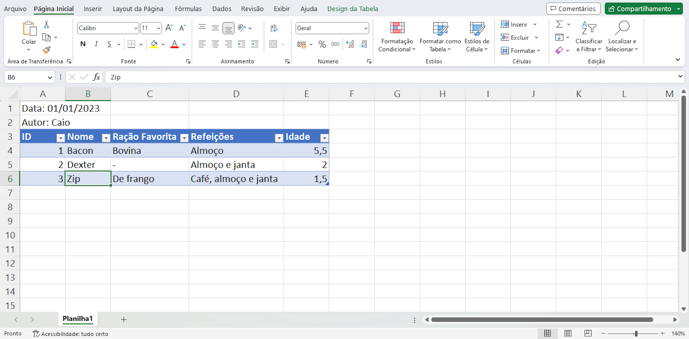

```{r setup, include=FALSE}
options(htmltools.dir.version = FALSE)
knitr::opts_chunk$set(comment = "#>", fig.align = "center")
options(dplyr.print_min = 5, dplyr.print_max = 5, dplyr.width = 70)
```

class: middle, center
# Iniciar gravação!

---
class: middle, center, inverse
# Importação

---
# Motivação

Já falamos um pouco sobre importação de dados no _R para Ciência de Dados I_,
mas agora precisamos nos aprofundar nesse tema. A realidade é que a importação é
provavelmente o passo mais importante do ciclo da ciência de dados e os
problemas que encontrarmos aqui podem ditar o futuro de uma análise.

Hoje vamos entender exatamente o que é um arquivo separado por delimitadores e a
diferença entre seus principais tipos. Vamos aprender todos os detalhes sobre a
leitura de arquivos Excel, incluindo os problemas que muitas vezes encontramos
pelo caminho. Também vamos falar sobre o Google Sheets e como ele pode ser um
jeito interessante de armazenar dados de forma persistente.

No limite, queremos desmistificar a importação de dados e entender como podemos
garantir que nenhuma informação seja perdida durante esse processo.

A maior parte da importação será feita pelo pacote readr, mas também vamos
precisar do readxl e do googlesheets4. Se você tem o tidyverse instalados, todos
eles já devem estar no seu computador.

---
# Projetos

Antes de começar o conteúdo, vamos criar um Rproj para guardar todos os dados e
scripts da aula. Isso já serve de prática para o mundo real, onde vamos querer
fazer isso de todo modo.

1. Criar um Rproj para esta aula (ou para o curso todo, o que você preferir).

2. Criar uma pasta `R` e uma pasta `data-raw` dentro do projeto. A primeira vai
ficar com todos os scripts e a segunda com todos os dados.

3. Baixar os dados que vamos utilizar hoje a partir do link:
https://github.com/curso-r/main-r4ds-3/raw/main/dados/02_faxina.zip

4. Descomprimir os dados e copiar todos os arquivos para dentro da pasta
`data-raw`. Garantir que os arquivos estão direto na pasta, não em uma
sub-pasta.

5. A partir de agora, todos os códigos que vamos mostrar hoje devem funcionar
dentro do Rproj!

---
class: center

```{r, echo = FALSE, out.width = "92%"}
knitr::include_graphics("img/02_faxina/rproj.png")
```

[Imagem do _R for Data Science_ (2e)](https://r4ds.hadley.nz/)

---
# Dados tabulares

Vamos começar com o tipo mais comum de dado tabulares (também chamados de dados
retangulares): valores separados por delimitadores ou **DSV** na sigla em
inglês.

DSVs são arquivos de texto normais que podem ser criados com absolutamente
qualquer programa de edição. Praticamente todo programa que lida com dados (do R
ao Excel) também é capaz de importar e exportar tabelas em algum tipo de DSV,
então esta é uma ótima escolha para quem quer compartilhar dados de forma
genérica.

Um arquivo DSV costuma começar com uma linha representando os nomes das colunas,
seguida de várias linhas com os dados. Independentemente do tipo de DSV, os
valores de cada linha são separados por um delimitador específico; é este
delimitador inclusive que determina o tipo de DSV com o qual estamos lidando.

O DSV mais comum é o CSV, que separa os valores com vírgulas. No Brasil e em
outros países que separam números decimais com vírgulas, CSVs
(contraintuitivamente) costumam separar os valores com pontos e vírgulas.

---
# Dados tabulares: CSV

CSV é a abreviação de valores separados pro vírgulas em inglês. Como o nome
sugere, esse é um tipo de dado tabular que usa a vírgula como delimitador.

```txt
id,nome,racao_favorita,refeicoes,idade
1,Bacon,Bovina,Almoço,5.5
2,Dexter,,Almoço e janta,2
3,Zip,De frango,"Café, almoço e janta",1.5
```

É um pouco difícil de ler os dados, mas alguns detalhes saltam aos olhos:

- Não há nenhum indicador do tipo de cada coluna.

- Casas decimais precisam ser separadas com pontos (formato inglês).

- Textos com vírgulas sempre precisam ser envoltos por aspas, senão eles vão ser
lidos como colunas distintas.

---
# Dados tabulares: leitura

Para ler arquivos CSV padrões, vamos usar a função `read_csv()`. Como fica claro
pelo exemplo abaixo, ela é capaz de inferir os tipos das colunas sem nenhum
problema.

```{r, eval = FALSE}
library(tidyverse) # Carrega o readr
read_csv("data-raw/racoes.csv")
```

```{r, echo = FALSE, message = FALSE, warning = FALSE}
library(tidyverse) # Carrega o readr
read_csv("../dados/02_faxina/racoes.csv", show_col_types = FALSE)
```

Note que o par de vírgulas seguidas do arquivo se transformou em um `NA` no data
frame importado. É assim que valores omissos são denotados em dados tabulares.

---
# Dados tabulares: CSV 2

O CSV 2 é a versão do CSV usada por países que não adotam o formato numérico
inglês. Neste caso, casas decimais precisam ser separadas com vírgulas e só
é necessário recorrer às aspas se houver um ponto e vírgula na string.

```txt
id;nome;racao_favorita;refeicoes;idade
1;Bacon;Bovina;Almoço;5,5
2;Dexter;;Almoço e janta;2
3;Zip;De frango;Café, almoço e janta;1,5
```

A leitura de uma base CSV 2 é feita de maneira similar a uma base CSV, mas com a
função `read_csv2()`. É importante notar que o R não detecta sozinho se uma
tabela é CSV ou CSV 2, então precisamos fazer isso por ele.

```{r, eval = FALSE}
# Saída idêntica à do slide anterior
read_csv2("data-raw/racoes2.csv")
```

---
# Argumentos

As funções de leitura do readr têm vários argumentos que podem nos ajudar com
dados mal formatados ou com outros problemas mais sérios. Os principais
argumentos aos quais temos acesso são os seguintes:

- `col_names`: indica se a primeira linha da tabela contém ou não o nome das
colunas. Também pode ser utilizado para (re)nomear colunas.

- `col_types`: caso alguma coluna seja importada com o tipo errado, esse
argumento para especificar a classe das colunas. Vamos falar mais sobre esse
argumento a seguir.

- `locale`: útil para tratar problemas relacionados à codificação dos dados.
Vamos falar mais sobre esse argumento a seguir.

- `na`: indica quais strings deverão ser consideradas `NA` na hora da
importação.

- `skip`: pula linhas no começo do arquivo antes de iniciar a importação.

---
# Argumentos: colunas

O argumento `col_types` é utilizado para forçar tipos de coluna caso a leitura
esteja tendo dificuldades. Para saber mais sobre as funções `col_*()`, consulte
a documentação com o comando `?cols()`.

```txt
id,nome,sexo,nasc,especie
1,Dexter,M,2021-03-20,Cão
2,Zip,M,2021-11-20,Cão
```

```{r, eval = FALSE}
"data-raw/caes.csv" |>
  read_csv(col_types = list(sexo = col_factor()))
```

```{r, echo = FALSE}
"../dados/02_faxina/caes.csv" |>
  read_csv(col_types = list(sexo = col_factor()))
```

---
# Argumentos: locale

Já falamos bastante sobre locale no _R para Ciência de Dados 2_, mas esse tipo
de problema retorna fortalecido durante a importação de dados. A função
`locale()` nos ajuda a determinar os idiomas ou formatos da tabela:

```txt
id,nome,sexo,nasc,especie
1,Dexter,M,20/03/2021,Cão
2,Zip,M,20/11/2021,Cão
```

```{r, eval = FALSE}
"data-raw/caes_loc.csv" |>
  read_csv(locale = locale(date_format = "%d/%m/%Y"))
```

```{r, echo = FALSE}
"../dados/02_faxina/caes_loc.csv" |>
  read_csv(locale = locale(date_format = "%d/%m/%Y"), show_col_types = FALSE)
```

---
# Argumentos: codificação

Também já falamos sobre _encoding_ antes e igualmente podemos ter problemas com
isso aqui. O erro mais comum é nos CSVs exportados pelo Excel: normalmente o
_encoding_ deles são `latin1` ou `windows-1252` (ver `?guess_encoding()`).

```txt
id,nome,sexo,nasc,especie
1,Dexter,M,2021-03-20,C�o
2,Zip,M,2021-11-20,C�o
```

```{r, eval = FALSE}
"data-raw/caes_xl.csv" |>
  read_csv(locale = locale(encoding = "windows-1252"))
```

```{r, echo = FALSE}
"../dados/02_faxina/caes_xl.csv" |>
  read_csv(locale = locale(encoding = "windows-1252"), show_col_types = FALSE)
```

---
# Excel

Já vimos como importar tabelas CSV exportadas pelo Excel, mas também podemos ler
planilhas Excel diretamente com a função `read_excel()` do pacote readxl!

A parte boa de ler dados diretamente do Excel é que não normalmente não temos
problemas de locale e codificação porque arquivos Excel já vêm embutidos com
esses metadados. A parte ruim é que normalmente criamos planilhas com muitos
recursos visuais que atrapalham a importação: cabeçalhos, formatações de
células, múltiplas tabelas por planilha, etc.

Felizmente, a `read_excel()` funciona de maneira similar às outras `read_*()` e
tem 2 novos argumentos que tentam tirar esses recursos visuais da frente:

- `sheet`: indica o número ou nome da planilha que deve ser lida.

- `range`: determina o retângulo exato que deve ser importado.

Para limpar os nomes de colunas, também temos a `janitor::clean_names()`.

---
class: middle, center

```{r, echo = FALSE}

```

---
# Excel: exemplo

```{r, eval = FALSE}
library(readxl)
"data-raw/racoes.xlsx" |>
  read_excel(
    sheet = 1,           # Primeira planilha
    range = "A3:E6",     # Retângulo a ser lido
    na = c("", "-")      # Valores NA
  ) |>
  janitor::clean_names() # Limpar nomes
```

```{r, echo = FALSE}
library(readxl)
"../dados/02_faxina/racoes.xlsx" |>
  read_excel(
    sheet = 1,           # Primeira planilha
    range = "A3:E6",     # Retângulo a ser lido
    na = c("", "-")      # Valores NA
  ) |>
  janitor::clean_names() # Limpar nomes
```

---
# Google Sheets

Ler tabelas do Google Sheets é quase igual a ler tabelas do Excel. Neste caso
vamos usar a função `read_sheet()` do pacote googlesheets4, que também faz parte
do tidyverse.

O primeiro ponto de diferença é na autenticação, necessária para que o
googlesheets4 funcione. Precisamos executar `gs4_auth()` pelo menos uma vez por
computador e autorizar o acesso do tidyverse à nossa conta; se não fizermos
isso, o pacote pode reclamar e te obrigar a fazer a autenticação em outro
momento.

```{r, eval = FALSE}
library(googlesheets4)
gs4_auth("clente@curso-r.com")
```

```{r, echo = FALSE}
library(googlesheets4)
```

Fora a autenticação, a segunda diferença entre o Excel e o Google Sheets é que
não passamos um caminho de arquivo para a `read_sheet()`, mas sim um URL ou o ID
de uma planilha. Adicionalmente, se não tivermos acesso devido a ela, ocorrerá
um erro na hora da leitura.

---
class: middle, center

```{r, echo = FALSE}

```

---
# Google Sheets: exemplo

```{r google-sheets, cache = TRUE, cache.extra = Sys.Date()}
"1p5tYOKzNfFf6ZlxDFwm0T5VtwnGSU565H3rHYWvi37M" |>
  read_sheet(
    sheet = 1,           # Primeira planilha
    range = "A3:E6",     # Retângulo a ser lido
    na = c("", "-")      # Valores NA
  )
```

---
# Outros formatos

Existem inúmeros outros formatos de dados que podemos encontrar no mundo real. O
tidyverse também nos disponibiliza outros pacotes e funções que podem ser úteis
nessas situações:

- Pacote haven: arquivos SPSS, Stata e SAS

- Pacote DBI: bases de dados (mais sobre isso na aula que vem)

- Pacote jsonlite: arquivos JSON

- Pacote xml2: arquivos HTML (XML no geral)

- Pacote httr: APIs da web e raspagem de dados

- `readr::read_lines()`: dados em texto

---
class: middle, center, inverse
# Valores omissos

---
# Motivação

Agora que já sabemos todas as nuances da importação de dados para dentro do R,
podemos continuar nossa aventura da faxina de dados.

Nesta seção vamos falar sobre valores omissos, mais conhecidos como `NA`s. Eles
podem representar diversas coisas e muitas vezes não prestamos atenção a esses
detalhes; não é incomum ver pessoas que "tratam" `NA`s removendo as linhas com
valores omissos sem pensar duas vezes.

No fundo, um `NA` pode corresponder a um dado que alguém esqueceu de registrar,
a uma informação que era impossível coletar ou a uma medida que não se sabia
fazer. Esses `NA`s podem ocorrer aleatoriamente ou não, carregando consigo dados
preciosos sobre a base e a metodologia por trás dela.

Sendo assim, precisamos tomar muito cuidado com os valores omissos. Hoje vamos
entender melhor o que são `NA`s **explícitos** e **implícitos**, assim como
quais são as funções do R para lidar com eles da melhor forma possível.

---
class: center, bottom

```{r, echo = FALSE}

```

[Ilustração por @allison_horst](https://twitter.com/allison_horst)

---
# NAs explícitos

Como o nome sugere, `NA`s explícitos podem ser observados diretamente no data
frame. Eles normalmente aparecem em tabelas que já foram preenchidas no formato
tidy ou que foram convertidas para este formato. Neste cenário, tratar um `NA`
significa removê-lo da maneira menos disruptiva possível.

```{r, eval = FALSE}
(treinos <- read_csv("data-raw/treinos.csv"))
```

```{r, echo = FALSE}
options(dplyr.print_min = 6)
treinos <- read_csv("../dados/02_faxina/treinos.csv", show_col_types = FALSE)
treinos
```

---
# fill()

A função `fill()` do pacote tidyr é perfeita para remover `NA`s que significam
"repetir o último valor". Ela substitui cada `NA` que ela encontrar com o valor
mais próximo para cima ou para baixo (dependendo do argumento `.direction`).

```{r}
treinos |>
  fill(nome)
```

---
# na_if()

A função `na_if()` do dplyr não remove `NA`s, mas ela os padroniza para que
possamos tratá-los da forma correta. Podemos usá-la para transformar valores
incongruentes (como notas negativas) em `NA`s verdadeiros.

```{r}
treinos |>
  mutate(nota_a = na_if(nota_a, -1))
```

---
# coalesce()

A função `coalesce()` do dplyr substitui `NA`s por um valor preestabelecido.
Este valor pode ser uma outra coluna (usar `nota_a` para cobrir o `NA` na
`nota_b`) ou uma sumarização da própria coluna (usar a média da `nota_b` para
cobrir o seu `NA`).

```{r}
treinos |>
  mutate(nota_b = coalesce(nota_b, mean(nota_b, na.rm = TRUE)))
```

---
# NAs implícitos

`NA`s implícitos não estão registrados nos data frames e precisam ser
"encontrados" por quem está analisando a base. Na maioria das vezes eles são
fruto de dados registrados a mão, pois raramente queremos perder tempo
cadastrando informações vazias. Para torná-los explícitos, precisamos utilizar
algum tipo de transformação como pivotagem, junção, etc.

```{r, eval = FALSE}
(medias <- read_csv("data-raw/medias.csv"))
```

```{r, echo = FALSE}
options(dplyr.print_min = 6)
medias <- read_csv("../dados/02_faxina/medias.csv", show_col_types = FALSE)
medias
```

---
# Pivotagem

Dependendo de como a base tiver sido registrada, um `pivot_wider()` ou um
`pivot_longer()` pode revelar `NA`s implícitos. A base resultante não
necessariamente será tidy nem terá nomes razoáveis de colunas, então precisamos
prestar atenção do data frame de saída.

```{r}
medias |>
  pivot_wider(
    names_from = ano,
    values_from = media
  )
```

---
# complete()

Ao invés de pivotar uma tabela, podemos utilizar a `complete()` do pacote tidyr.
Ela cruza as informações de duas ou mais colunas e cria um `NA` para todo
cruzamento que ainda não tiver representante na tabela.

```{r}
medias |>
  complete(ano, semestre)
```

---
# Junção

Uma junção (normalmente chamada de _join_) é o processo de combinar os dados de
duas tabelas em uma só. Vamos falar mais sobre isso na aula que vem, mas é muito
comum que um join revele `NA`s implícitos.

```{r, echo = FALSE}
profs <- read_csv("../dados/02_faxina/profs.csv", show_col_types = FALSE)
```

```{r}
medias |>
  full_join(profs, join_by(ano, semestre)) # Tabela com os profs
```

---
# Rodada bônus: fatores

Como comentado no _R para Ciência de Dados II_, variáveis categóricas conseguem
conter níveis que não possuem nenhum representante na tabela; isso é comum
quando filtramos `NA`s e uma categoria tem poucos elementos. Neste caso, podemos
usar a função `count()` do pacote dplyr com `.drop = FALSE` para revelar os
níveis com 0 representantes.

```{r, eval = FALSE}
"data-raw/caes.csv" |>
  read_csv() |>
  mutate(sexo = fct(sexo, c("M", "F"))) |>
  count(sexo, .drop = FALSE)
```

```{r, echo = FALSE}
"../dados/02_faxina/caes.csv" |>
  read_csv(show_col_types = FALSE) |>
  mutate(sexo = fct(sexo, c("M", "F"))) |>
  count(sexo, .drop = FALSE)
```

---
# Rodada bônus: gráficos

Gráficos também são uma maneira de exibir `NA`s implícitos se estivermos na
situação descrita no slide anterior. No caso de a coluna ser um fator com níveis
sem representantes, podemos utilizar a mesma abordagem e passar o argumento
`drop = FALSE` para a `scale_x_discrete()`; se não fizermos isso, o gráfico
omitirá a categoria vazia, dando a impressão de que ela não existe.

Este argumento está disponível em todas as escalas discretas do ggplot2, então
ele não se aplica somente a essa função.

```{r, eval = FALSE}
# Resultado no próximo slide
"data-raw/caes.csv" |>
  read_csv() |>
  mutate(sexo = fct(sexo, c("M", "F"))) |>
  ggplot(aes(x = sexo)) +
  geom_bar() +
  scale_x_discrete(drop = FALSE)
```

---
class: middle, center

```{r, echo = FALSE}
# Resultado no próximo slide
"../dados/02_faxina/caes.csv" |>
  read_csv(show_col_types = FALSE) |>
  mutate(sexo = fct(sexo, c("M", "F"))) |>
  ggplot(aes(x = sexo)) +
  geom_bar() +
  scale_x_discrete(drop = FALSE) +
  theme(text = element_text(size = 20))
```

---
class: middle, center, inverse
# Fim
