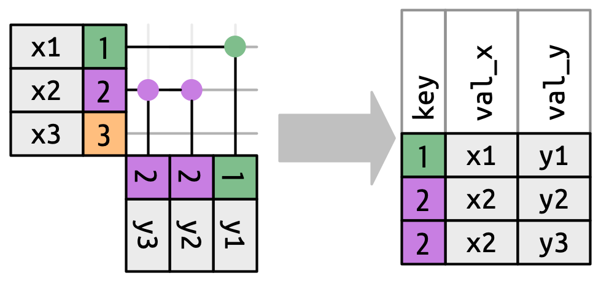

```{r setup, include=FALSE}
options(htmltools.dir.version = FALSE)
knitr::opts_chunk$set(comment = "#>", fig.align = "center")
options(dplyr.print_min = 5, dplyr.print_max = 5, dplyr.width = 70)
```

class: middle, center
# Iniciar gravação!

---
class: middle, center, inverse
# DBI

---
# Motivação

Bancos de dados (BDs) são programas capazes de armazenar e consultar grandes
quantidades de dados. Diferentemente do R, que precisa ter seus dados carregados
na memória RAM, a maioria dos BDs é capaz de operar em dados disponíveis apenas
no disco rígido. Via de regra, um computador padrão tem muito mais disco do que
RAM porque o primeiro é bem mais barato.

Em virtude dessa diferença de preço (e vários outros motivos), é comum que as
maiores bases sejam acessíveis apenas via um BD. Cada empresa costuma ter seu
próprio servidor com um sistema de gerenciamento de bancos de dados (SGBD),
assim qualquer analista pode facilmente acessar as bases necessárias para seus
projetos. O SQL Server, da Microsoft, é um dos SGBDs mais comuns no mercado.

O problema é que esses SGBDs são otimizados para coletar dados, não analisá-los.
A linguagem básica de qualquer SGBD é o SQL, que infelizmente é muito mais
complexo e confuso do que a sintaxe do tidyverse à qual nos acostumamos. Vamos
falar mais sobre SQL depois, mas por enquanto gostaríamos de evitar aprender
essa linguagem o máximo possível. Será que existe uma solução para o nosso
problema?

---
# Bancos de dados

No nível mais básico, um BD é uma coleção de tabelas. Assim como um data frame,
uma tabela é uma coleção de colunas nomeadas, onde cada coluna possui um tipo
distinto. Até aí parece que não teríamos muito problema de usar o R para
trabalhar os dados de um BD...

O problema é que quase nenhum SGBD tem suporte embutido ao R, porque ele é uma
linguagem que fundamentalmente opera em memória RAM. Isso quer dizer que
precisamos de um jeito de conectar o R aos BDs que armazenam os nossos dados.
Caso contrário, toda vez que precisarmos fazer alguma mudança, vamos ter que
falar com a pessoa responsável pelo BD.

Mas como seria possível ter uma maneira consistente de conectar o R a todos os
bancos de dados que existem? Temos SGBDs que necessitam de um servidor central
poderoso (PostgreSQL, MariaDB, SQL Server, MySQL, etc.), SGBDs que rodam
exclusivamente na nuvem (Snowflake, RedShift, BigQuery, etc.) e SGBDs capazes de
funcionar em computadores comuns como os nossos (SQLite, duckdb, etc.); como
podemos reduzir toda essa complexidade e ao mesmo tempo usar o R?

---
# O pacote DBI

O pacote DBI (do inglês _**d**ata**b**ase **i**nterface_) oferece uma interface
R para todos os SGBDs mais populares. Ele possui funções genéricas de conexão,
escrita, leitura, etc. que servem para qualquer BD, dado que todos usam versões
muito similares do SQL. A grande vantagem do DBI é que outros pacotes podem
pegar essas funções genéricas e implementar versões específicas delas que
funcionam para um único SGBD. No final, podemos usar sempre as mesmas funções
para acessar qualquer BD e precisamos apenas tomas o cuidado de escolher o
_backend_ correto!

Sendo assim, se o SGBD que precisamos acessar for PostgreSQL, vamos ter que usar
o pacote RPostgres; se o BD for MySQL, vamos ter que usar o RMariaDB (sim, o
mesmo pacote vale para MySQL e MariaDB, por isso o nome estranho); etc.

Se não conseguirmos encontrar um pacote específico para o nosso SGBD,
provavelmente podemos simplesmente usar o pacote odbc, que usa o amplamente
suportado protocolo ODBC. A única ressalva é que o odbc precisa de mais
configuração, pois precisamos instalar os drivers necessários do ODBC e ensinar
o pacote odbc a encontrá-los.

---
# Conexão

Para o DBI, a diferença entre SGBDs aparece praticamente só na conexão: usamos a
função `dbConnect()` e, como primeiro argumento, o seletor do pacote cliente.
Vale ressaltar que cada SGBD tem o seu processo de autenticação, então
precisamos verificar a documentação de cada pacote para saber o que é
necessário. Abaixo vemos dois exemplos (não executados) de como conectar a um
BD.

```{r, echo = FALSE}
library(DBI)
```

```{r, eval = FALSE}
library(DBI)
con <- dbConnect(
  RMariaDB::MariaDB(),
  username = "pessoa"
)
con <- dbConnect(
  RPostgres::Postgres(),
  hostname = "banco.empresa.com",
  port = 1234
)
```

---
# duckdb

O custo de criar um BD na nuvem para usarmos neste curso seria grande demais,
então vamos recorrer a uma ótima alternativa: o duckdb. Esse SGBD está
totalmente encapsulado dentro do pacote e é capaz de criar um banco local de
alta performance! A conexão segue o mesmo princípio do slide anterior, mas não
precisamos autenticar nada.

```{r}
con <- dbConnect(duckdb::duckdb())
```

O duckdb é uma ótima alternativa para iniciantes que querem testar as
funcionalidades do DBI, mas não quer pagar pela infraestrutura de um SGBD
comercial. Se quiséssemos usar o duckdb para um projeto de verdade,
precisaríamos escolher um diretório onde armazenar os nossos dados
permanentemente.

```{r, eval = FALSE}
# Executar no seu Rproj do curso
con <- dbConnect(duckdb::duckdb(), dbdir = "data-raw/duck")
```

---
# Escrita

Para escrever no BD uma base que temos no computador, usamos a função
`dbWriteTable()`. O seu primeiro argumento é a conexão, o segundo é o nome da
tabela e o terceiro é o data frame. Esse passo normalmente não é necessário,
pois quase sempre queremos ler uma tabela que já está no banco.

```{r, echo = FALSE}
racoes <- readr::read_csv("../dados/02_faxina/racoes.csv", show_col_types = FALSE)
```

```{r}
# Tabela da aula passada, disponível em racoes.csv
dbWriteTable(con, "racoes", racoes)
```

A função `dbListTables()` é bastante útil, porque ela lista todas as tabelas
salvas no BD. É comum um BD ter dezenas e até centenas de tabelas distintas,
então podemos consultar todas sem precisar falar com a pessoa responsável pelo
banco.

```{r}
dbListTables(con)
```

---
# Leitura

Para ler uma tabela salva no BD, usamos a função `dbReadTable()`. O seu primeiro
argumento é a conexão e o segundo é o nome da tabela. Note que a saída é um data
frame comum, não uma tibble do tidyverse como normalmente.

```{r}
dbReadTable(con, "racoes")
```

Se soubermos alguma coisa de SQL, já podemos executar nossa primeira consulta. A
função `dbGetQuery()` recebe uma string com código SQL e o executa direto no BD.

```{r, eval = FALSE}
# Saída idêntica à acima
dbGetQuery(con, "SELECT * FROM racoes")
```

---
# O pacote dbplyr

Se não quisermos aprender SQL, o pacote dbplyr é perfeito porque ele faz os
verbos do dplyr funcionarem com BDs conectados via DBI. Por trás dos panos, ele
está traduzindo todos os nossos comandos para SQL.

```{r, message = FALSE}
library(tidyverse)
library(dbplyr)

(racoes <- tbl(con, "racoes"))
```

---
# Consultas

A partir do momento em que tivermos um objeto gerado pela função `tbl()`,
podemos usar as funções do dplyr normalmente. O dbplyr também mantém uma
referência ao fato de que está base está sendo consultada via duckdb.

```{r}
racoes |>
  filter(idade < 3) |>
  select(id:refeicoes) |>
  mutate(letras = str_length(nome))
```

---
# SQL

A operação do slide anterior toda foi convertida para SQL e podemos ver isso com
`show_query()`. Isso também serve de lembrete de que **nem todas** as funções do
tidyverse funcionam com o dbplyr! Operações complexas de modelagem estatística,
por exemplo, precisam ser executadas depois que a tabela vier para o R.

```{r}
racoes |>
  filter(idade < 3) |>
  select(id:refeicoes) |>
  mutate(letras = str_length(nome)) |>
  show_query()
```

---
# Tabelas preguiçosas

Como aludido no slide anterior, nenhuma das operações demonstradas até agora de
fato estão sendo executadas; para executá-las e trazer o resultado para dentro
do R, precisamos usar a função `collect()`. Se a nossa tabela fosse maior, o R
nem saberia dizer o número de linhas que ela tem antes do `collect()`!

```{r}
racoes |>
  filter(idade < 3) |>
  select(id:refeicoes) |>
  mutate(letras = str_length(nome)) |>
  collect()
```

---
# Rodada bônus: Spark

Spark, diferentemente dos BDs que vimos até agora, é um motor de análise de
dados em larga escala. Ele tem interfaces com diferentes linguagens e pode
executar operações de machine learning em data frames imensos através de
clusters Hadoop, Kubernetes, etc.

```{r, eval = FALSE}
# Instalar o pacote sparklyr
install.packages("sparklyr")

# Instalar o Spark localmente para testes
spark_install()

# Conectar com um cluster local temporário
con <- spark_connect(master = "local")
```

Para saber mais sobre como usar o Spark de maneira efetiva, a documentação
oficial do sparklyr é um ótimo lugar para começar: https://spark.rstudio.com/.

---
class: middle, center, inverse
# Junção

---
# Motivação

A partir do momento em que somos capazes de trabalhar com bancos de dados,
aumenta muito a nossa necessidade de conseguir cruzar tabelas. Isso acontece
porque raramente uma análise vai depender de um só data frame; por questões de
espaço e eficiência, é comum dividir os dados do banco ao longo de múltiplas
tabelas que podem ser unidas posteriormente conforme a necessidade.

Esse processo pode levar muitos nomes: junção, cruzamento, união, join, etc. O
termo correto em português é junção, mas é muito mais comum falarmos cruzamento
ou join.

Apesar de já termos aprendido um pouco sobre o assunto no _R para Ciência de
Dados I_, hoje vamos explorá-lo a fundo e ver todos os tipos de joins que o
pacote dplyr pode nos oferecer. Também vamos falar um pouco da teoria por trás
das junções, como por exemplo o que é uma chave e para quê ela serve.

No final da aula vamos ter aprendido todos os joins mais comuns e como usar a
função `join_by()` para reduzir muito o nosso trabalho com joins complexos.

---
# Junção

Cruzar duas bases significa unir as suas colunas de uma forma consistente. Um
exemplo clássico no R é o pacote nycflights13, cujas tabelas tratam de voos
nova-iorquinos de 2013; com ele, podemos querer juntar os dados de clima com os
de decolagens, os dados de aviões com os de companhias aéreas, e assim por
diante.

Para simplificar o problema, vamos usar duas tabelas bastante simples chamadas
`x` e `y`. A `x` tem as colunas `key` e `val_x`, enquanto a `y` tem `key` e
`val_y`. Nosso objetivo vai ser (quase) sempre conectar `val_x` e `val_y` usando
alguma regra com `key`.

```{r, echo = FALSE, fig.align = "center", out.width = "25%"}
knitr::include_graphics("img/03_bancos/setup.png")
```

Todas as imagens deste módulo são do [_R for Data Science_
(2e)](https://r4ds.hadley.nz/).

---
# Chaves

Uma **chave primária** é uma coluna ou conjunto de colunas que identifica
singularmente cada observação de uma tabela. Em uma tabela de pessoas, por
exemplo, o CPF delas sempre vai ser uma chave primária.

Em contrapartida, uma **chave estrangeira** é uma coluna ou conjunto de colunas
que correspondem a uma chave primária de outra tabela. Em uma tabela de compras,
o CPF de quem fez a compra é uma chave estrangeira para a tabela de pessoas. É
importante lembrar que duas tabelas podem ter as mesmas chaves, ou seja, elas
serão tanto primárias quanto estrangeiras!

No limite, não precisamos nos preocupar com esses termos técnicos. Na hora de
cruzar duas tabelas, precisamos decidir qual(is) coluna(s) da primeira casa(m)
com qual(is) coluna(s) da segunda. No exemplo acima, provavelmente vamos querer
que a coluna CPF da tabela de pessoas case com a coluna CPF da tabela de
compras. As linhas da tabela resultante trarão as informações cadastrais de cada
pessoa (email, nome, idade, etc.) e as informações de cada compra feita em seu
CPF (valor, itens, data, etc.)

---
# Junções com transformações

O primeiro tipo de join é o mais simples: a **junção com transformação**. Um
cruzamento desse tipo casa as linhas de duas tabelas de acordo com suas chaves,
depois copia as variáveis de uma tabela para a outra. É exatamente o processo
que vimos no slide anterior.

As funções de join do dplyr recebem as duas tabelas e uma especificação dada
pela função `join_by()`, que recebe uma ou mais expressões para definir o join.
No caso abaixo, estamos dizendo que a `key` de `x` casa com a `key` de `y`.

```{r, echo = FALSE}
x <- tribble(
  ~key, ~val_x,
     1, "x1",
     2, "x2",
     3, "x3"
)
y <- tribble(
  ~key, ~val_y,
     1, "y1",
     2, "y2",
     4, "y3"
)
```

```{r}
inner_join(x, y, join_by(key == key)) # Mais sobre join_by() em breve
```

---
# left_join()

O join mais comum é o `left_join()`. No geral usamos ele para adicionar novos
dados a uma tabela principal, ou seja, queremos preservar todas as linhas da
tabela principal e adicionar novas informações onde for possível.

No exemplo abaixo, a tabela resultante tem as mesmas linhas de `x` com a adição
dos dados carregados pela `y` (somente onde eles estão disponíveis).

```{r, echo = FALSE, fig.align = "center", out.width = "50%"}
knitr::include_graphics("img/03_bancos/left_join.png")
```

---
# right_join()

O `right_join()` é o oposto do `left_join()`, ou seja, ele assume que a tabela
principal é `y` e não `x`. Ele é bastante útil quando precisamos fazer o join
dentro da pipeline que está tratando a tabela secundária.

No exemplo abaixo, a tabela resultante tem as mesmas linhas de `y` com a adição
dos dados carregados pela `x` (somente onde eles estão disponíveis).

```{r, echo = FALSE, fig.align = "center", out.width = "50%"}
knitr::include_graphics("img/03_bancos/right_join.png")
```

---
# inner_join()

O `inner_join()` funciona de maneira similar ao `left_join()`, mas ele remove
todas as linhas de `x` que não têm nenhuma correspondência em `y`. Ele é útil
para encontrar a intersecção entre duas tabelas.

No exemplo abaixo, a tabela resultante tem as linhas de `x` que encontraram
correspondente em `y`, com a adição dos dados carregados pela `y`.

```{r, echo = FALSE, fig.align = "center", out.width = "50%"}
knitr::include_graphics("img/03_bancos/inner_join.png")
```

---
# full_join()

O `full_join()` é o oposto do `inner_join()`, pois ele mantém todas as linhas de
ambas as tabelas sendo cruzadas. Podemos usá-lo para fazer a união entre duas
tabelas e observar tanto as suas intersecções quanto suas diferenças.

No exemplo abaixo, a tabela resultante tem todas as linhas de `x` e de `y`.

```{r, echo = FALSE, fig.align = "center", out.width = "50%"}
knitr::include_graphics("img/03_bancos/full_join.png")
```

---
# Linhas repetidas

Nos joins que vimos até agora é muito comum ter várias linhas de uma tabela
casando com uma linha de outra e normalmente não há nada de errado com isso. No
próprio exemplo das compras, cada pessoa poderia ter feito várias aquisições!

Abaixo vemos o que aconteceria se `y` tivesse duas linhas correspondendo com a
segunda linha de `x` e, como é de se esperar, `x2` é replicada para casar com
`y2` e `y3`. É justamente para evitar o desperdício de espaço com duplicações
que bancos de dados normalmente são compostos de múltiplas tabelas menores.

```{r, echo = FALSE, fig.align = "center", out.width = "50%"}

```

---
# Junções com filtros

O segundo tipo de join serve, na verdade, para filtrar tabelas: a **junção com
filtro**. Um cruzamento desse tipo casa as linhas de duas tabelas de acordo com
suas chaves, mas, ao invés de combinar suas colunas, ele filtra as linhas da
primeira tabela conforme a função utilizada.

Para simplificar o problema, vamos continuar usando as mesmas tabelas que vimos
até agora, `x` e `y`. Lembrando que a `x` tem as colunas `key` e `val_x`,
enquanto a `y` tem `key` e `val_y`.

```{r}
semi_join(x, y, join_by(key == key)) # Mais sobre join_by() em breve
```

---
# semi_join()

O `semi_join()` é similar ao `left_join()`, com a exceção de que ele não traz os
dados da tabela secundária para a tabela principal. Por ser uma junção com
filtro, ele retorna as linhas da tabela principal que tenham correspondente na
secundária.

No exemplo abaixo, a tabela resultante é igual a `x` filtrada, ou seja, somente
com as linhas com correspondente em `y`.

```{r, echo = FALSE, fig.align = "center", out.width = "50%"}
knitr::include_graphics("img/03_bancos/semi_join.png")
```

---
# anti_join()

O `anti_join()` é o oposto do `semi_join()`, pois ele faz literalmente a
operação contrária. Ela exclui as linhas da tabela principal que tenham
correspondente na tabela secundária e retorna o resto.

No exemplo abaixo, a tabela resultante é igual a `x` filtrada, mantendo apenas
as linhas sem correspondente em `y`.

```{r, echo = FALSE, fig.align = "center", out.width = "50%"}
knitr::include_graphics("img/03_bancos/anti_join.png")
```

---
# join_by()

No primeiro exemplo de join nós usamos a `join_by()`, mas depois disso não
falamos mais dela. Por padrão os joins procuram todas as colunas com os mesmos
nomes nas duas tabelas e usam esse conjunto como chaves, então não precisávamos
de `join_by()` com a `x` e a `y`.

```{r, eval = FALSE}
left_join(x, y)
```

Se quiséssemos explicitar as chaves, podemos usar uma expressão dentro da
`join_by()` como terceiro argumento do join.

```{r, eval = FALSE}
left_join(x, y, join_by(key == key)) # x$key casa com y$key
left_join(x, y, join_by(key)) # x$key casa com y$key
left_join(a, b, join_by(col1 == col2)) # a$col1 casa com b$col2

# a$col1 casa com b$col2 e a$col3 casa com b$col4
left_join(a, b, join_by(col1 == col2, col3 == col4))
```

---
# Junção não idêntica

No slide anterior, usamos sempre o sinal de igualdade dentro da `join_by()`, mas
isso não é necessário! Até agora só vimos junções idênticas (_equi joins_),
contudo podemos fazer também junções não idênticas (_non-equi joins_).

Sendo assim, temos quatro tipos de join sendo que apenas o primeiro deles é um
join idêntico:

- Condição de igualdade: `==`

- Condição de desigualdade: `>=`, `>`, `<=` ou `<`

- Rolagem: `closest()`

- Sobreposição: `between()`, `within()` ou `overlaps()`

Assim como no caso do _equi join_, os _non-equi_ serão declarados dentro da
função `join_by()` durante a especificação do cruzamento.

---
# Desigualdades

Uma junção com desigualdade é funciona igual à função de join sendo utilizada no
sentido de que ela realizará a mesma operação de cruzamento. A diferença é que a
correspondência entre as duas ocorre não pela igualdade entre as chaves, mas sim
por uma desigualdade entre elas. Além disso, as chaves não são fundidas!

No exemplo de `left_join()` abaixo, as chaves de `x` casam com as chaves de `y`
maiores ou iguais a elas próprias.

```{r, echo = FALSE, fig.align = "center", out.width = "50%"}
knitr::include_graphics("img/03_bancos/inequality.png")
```

---
# Rolagem

Qualquer junção com desigualdade pode ser transformada em uma junção com rolagem
através da função `closest()`. Neste caso, serão retornadas apenas as linhas do
join que atendam à desigualdade com o mínimo de diferença possível.

No exemplo de `left_join()` abaixo, os círculos representam todas as
correspondências da desigualdade. Com a `closest()`, apenas os círculos pretos
serão retornados.

```{r, echo = FALSE, fig.align = "center", out.width = "40%"}

```

---
# Sobreposição

Uma junção com sobreposição é um atalho para uma junção com desigualdade
complexa. No fundo, estamos apenas reduzindo a quantidade de expressões que
vamos escrever, mas o resultado é absolutamente o mesmo.

Temos três funções de sobreposição que devem ser colocadas dentro da `join_by()`
da mesma maneira que a `closest()`. Elas são as seguintes:

- `between(col1, col2, col3)`: equivalente a `col1 >= col2, col1 <= col3`, ou
seja, `col1` deve estar entre `col2` e `col3`

- `within(col1, col2, col3, col4)`: equivalente a `col1 >= col3, col2 <= col4`,
ou seja, se o intervalo [`col1`, `col2`] está completamente contido no intervalo
[`col3`, `col4`]

- `overlaps(col1, col2, col3, col4)`: equivalente a `col1 <= col4, col2 >=
col3`, ou seja, se o intervalo [`col1`, `col2`] tem alguma intersecção com o
intervalo [`col3`, `col4`]

---
class: middle, center, inverse
# Fim
